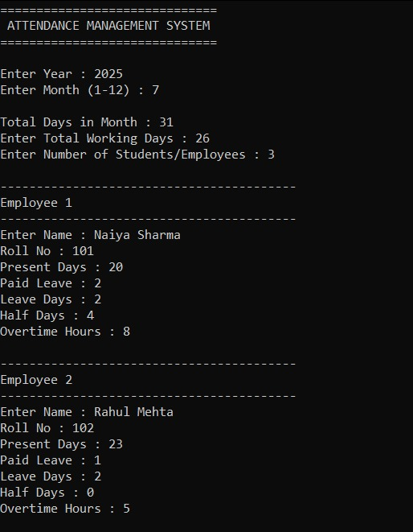
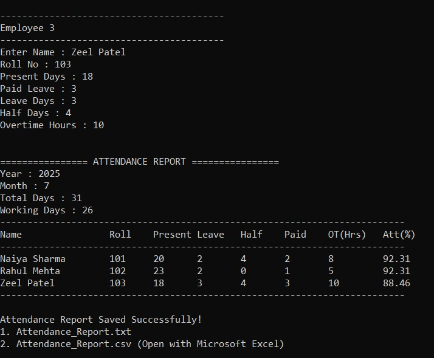
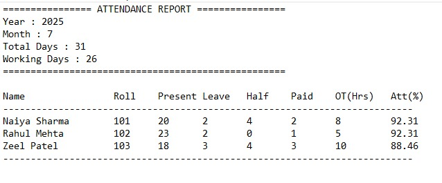
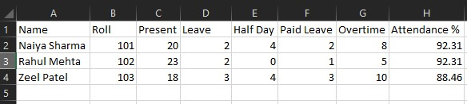

# 📋 Attendance Management System

A console-based **Attendance Management System** developed in **C++**. The system manages attendance records for students or employees, validates user input, calculates attendance percentage, and generates reports in **TXT** and **CSV** formats.

## ✨ Features

- 📅 Year & Month Selection
- 📆 Leap Year Support
- ✅ Working Days Validation
- 🔢 Input Validation
- 📊 Attendance Percentage Calculation
- 📄 TXT Report Generation
- 📑 CSV Report Generation (Excel Compatible)

## 🛠️ Technologies Used

- C++
- File Handling (`fstream`)
- Structures
- Functions

## 📸 Screenshots

### Console Input

### Console Output

### TXT Report

### CSV Report (Excel)

## 👩‍💻 Author

**Naiya Sharma**

GitHub: **@naiya555**
